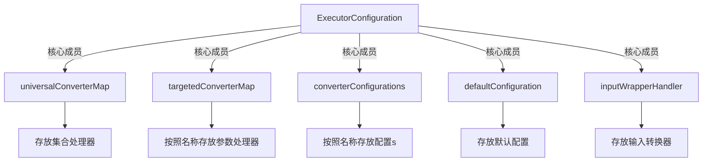
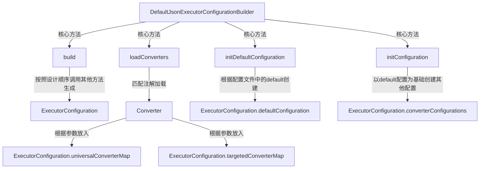
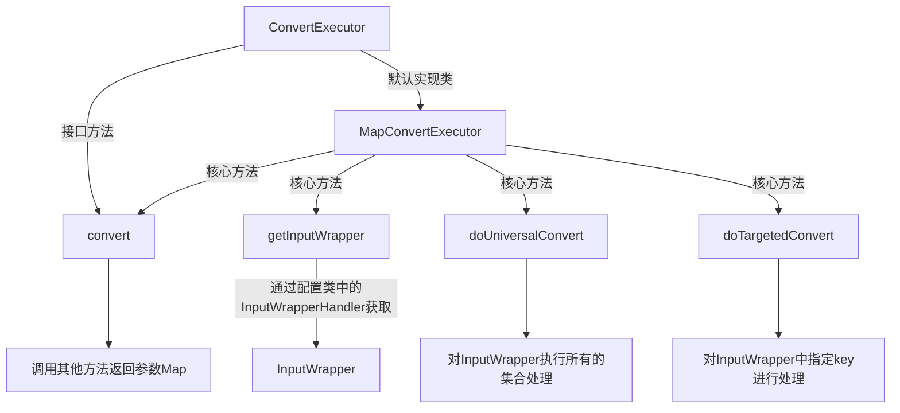
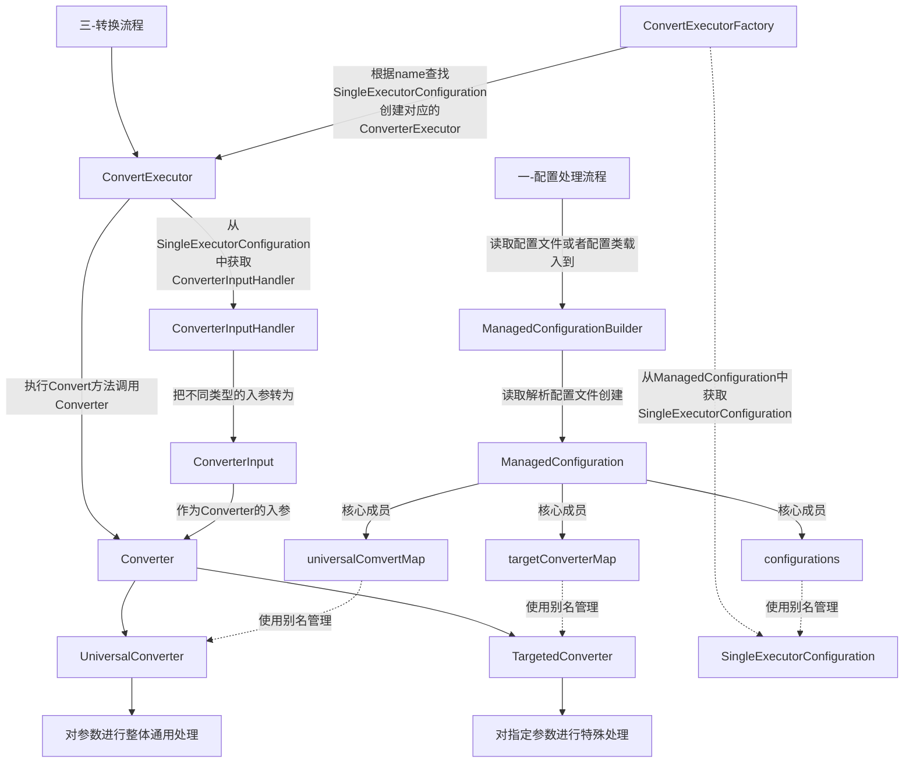
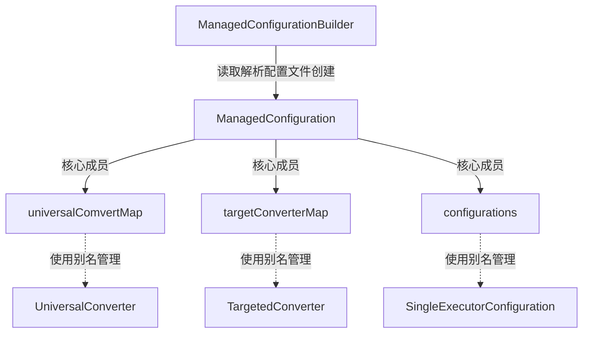
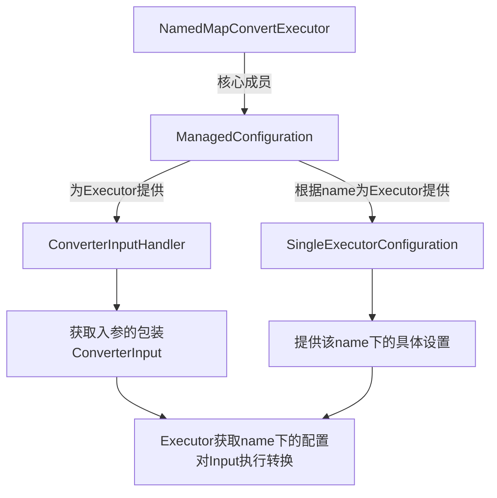
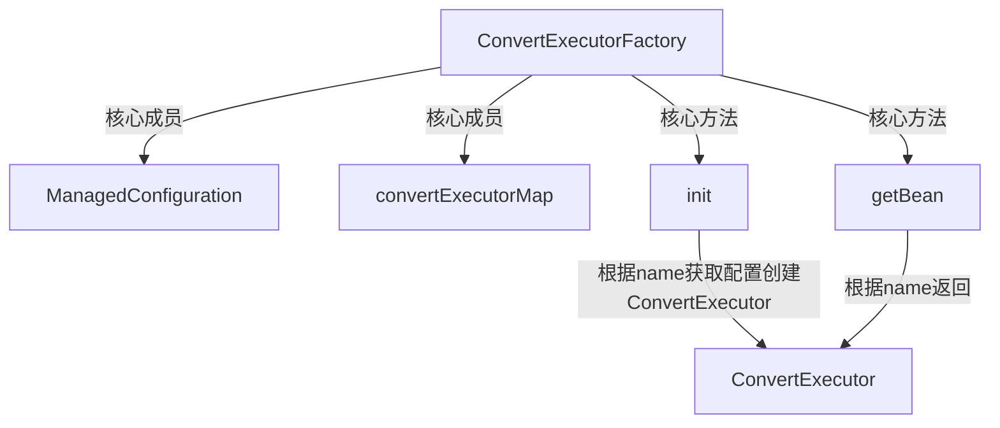
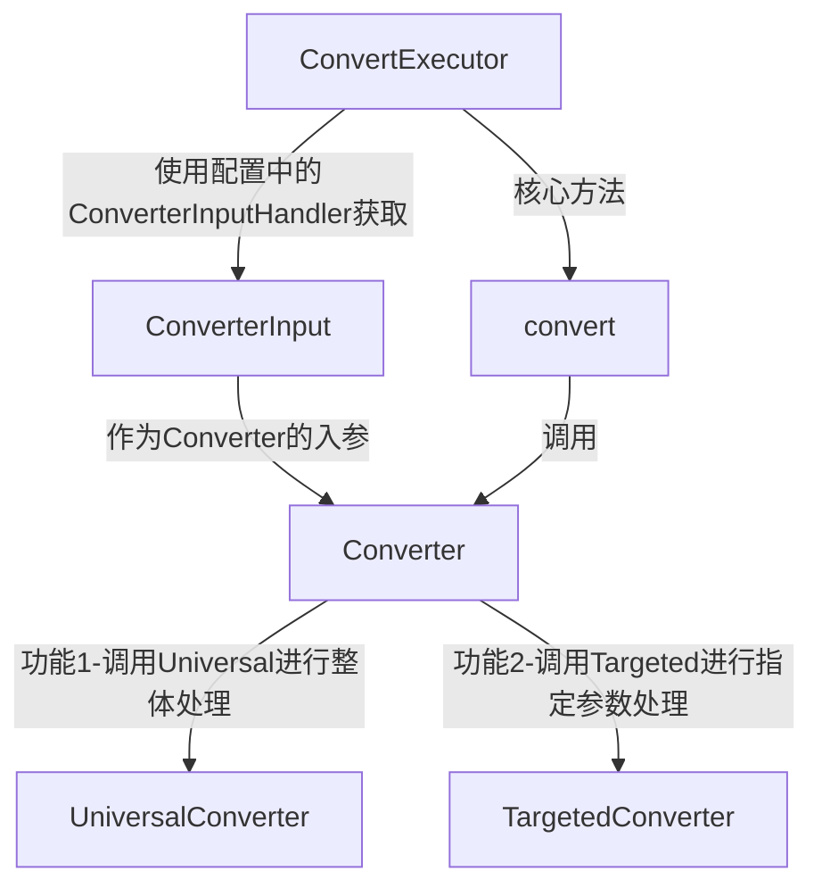

# ParameterConverter

## 项目架构 - 第二版
> 配置

> 配置的Builder

> 执行

## 项目架构 - 第一版
> 建议参看下面的模块结构

## 模块架构
> 配置解析

> executor 执行 NamedMapConvertExecutor

> ConvertExecutor获取 - 过期 - 可用

> ConvertExecutor工作原理 - 过期 - 可用

> 功能开发

- Configuration
  - 配置文件支持
    - 支持 properties 简单配置 √
    - 支持json配置
    - 支持注解扫描Converter进行配置
  - 可配置内容支持
    - 配置通用converter √
    - 配置指定key的converter √
    - 配置过滤器，只处理匹配的入参
- ConvertExecutor
  - DefaultMappedConvertExecutor √
  - 针对HttpServelt优化的ConvertExecutor
- 需要更多优化的内容
  - static 方法性能
  - 单例化
  - converter 关键字匹配流程
    - 循环匹配关键字的性能问题

> KingLeading提醒：处理 HttpServletRequest的时候，尽量不要修改对象的原本属性

---------------------------------------------

开发日志：

- 20181226： 

> 问题1 参数匹配

例如 我们配置了  使用 kg2k  处理的参数 有  weight，totalweight 等，某些按照我们设计的数据确实应该这样处理，但是也有可能 某个接口中 weight 不表示重量，或者weight不代表kg而是代表 g或者吨等单位，要处理好这种情况，就需要修改约定参数  比如把 weight 改为 weight_kg 然后对 weight_kg 进行识别。

这种情况下，如果是一两个参数还好，所有参数都这样做无疑非常麻烦，并且 如果接口已经在使用，那么引入这套框架成本非常高.

> 问题2 执行效率

在原本的参数匹配流程中，首先要循环 入参参数列表，判断每一个入参 是否在 每个转换器的列表中。这是一个三层的循环

这里把 collection 中的 contains 方法也堪称循环

- 循环入参参数
  - 循环每个处理器
    - 循环每个处理器的参数列表

以上两个问题解决方案： 
- 给一套配置命名，允许同时存在多套配置，配置之间独立，在使用的时候，我们可以给接口级别 或者 模块级别定制配置（通常一个模块里面的参数名称如果相同，含义也应该相同，这种情况下，每个模块一套配置，没有特殊转化需求的可以使用通用配置）
- 关于循环效率，因为参数是约定完成的，所以只需循环 key - executor ，然后从入参中用key查找即可（相信hash的效率），并且因为每个（功能模块）所配置的 Executor都是真正需要的，就避免了原本框架中的无用循环